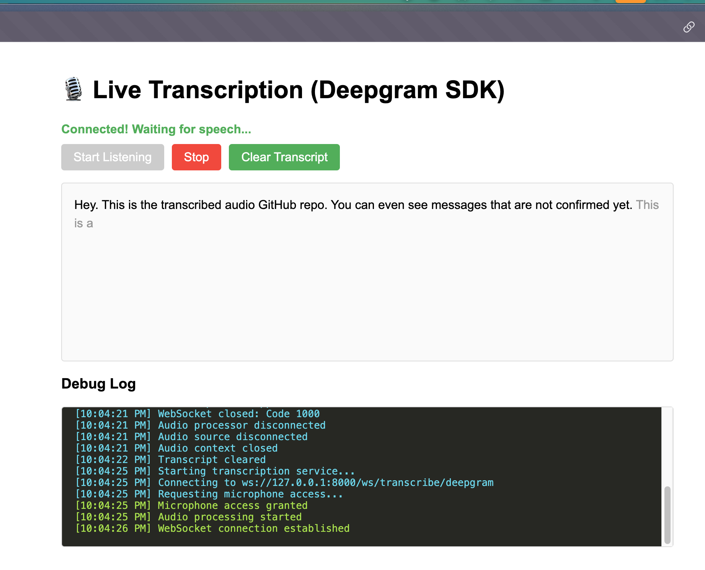

# Real-Time Audio Transcription

A FastAPI-based web application that provides real-time speech transcription using Deepgram's speech recognition API.

## Features

- Real-time audio transcription via WebSocket connection
- Browser-based audio capture and streaming
- Deepgram integration for accurate speech recognition
- Responsive web interface

## Screenshot



## Prerequisites

- Python 3.7+
- Deepgram API key ([Get one here](https://deepgram.com/))

## Installation

1. Clone the repository:
```bash
git clone <repository-url>
cd transcribe_audio
```

2. Install dependencies:
```bash
pip install fastapi uvicorn deepgram-sdk
```

3. Set your Deepgram API key:
```bash
export DEEPGRAM_API_KEY=your_api_key_here
```

## Usage

### Development
```bash
uvicorn app:app --reload
```

### Production
```bash
uvicorn app:app --workers 4
```

### Custom host/port
```bash
uvicorn app:app --host 0.0.0.0 --port 8000 --reload
```

## Endpoints

- `GET /` - Main landing page
- `GET /transcribe` - Transcription interface
- `WebSocket /ws/transcribe/deepgram` - Real-time transcription endpoint

## Audio Format

The application expects audio in 16kHz PCM format (16-bit linear, mono channel).

## Project Structure

```
transcribe_audio/
├── app.py              # Main FastAPI application
├── static/
│   ├── index.html      # Landing page
│   └── transcribe.html # Transcription interface
└── README.md
```

## License

MIT License